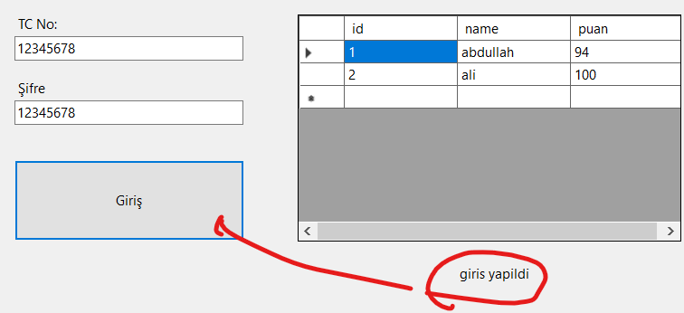
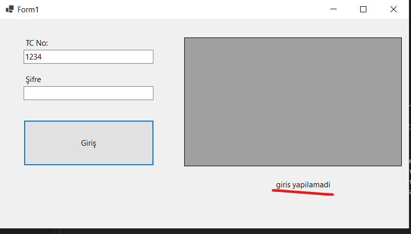
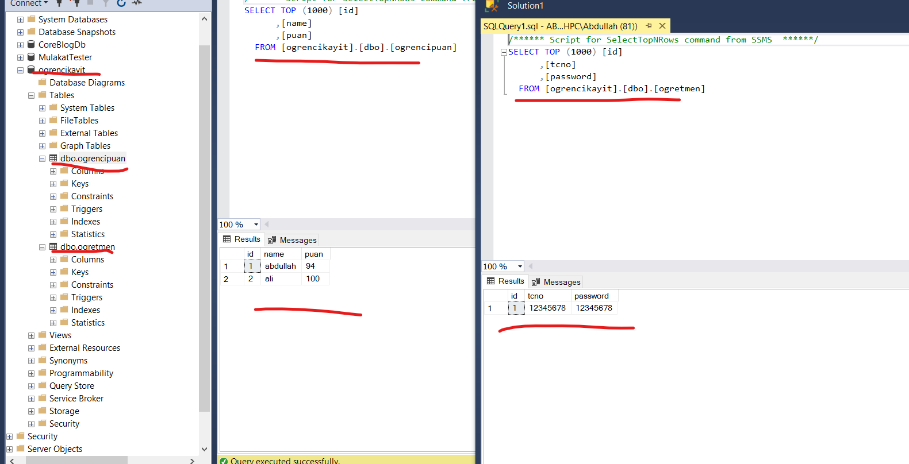

<p align="center">
  <a href="https://www.w3schools.com/cs/" target="_blank" rel="noreferrer">  </a>
   <a href="" target="_blank" rel="noreferrer">  </a>
</p>

<h3 align="center">Ders Puan Kayıt Programı</h3>

<div align="center">

[](/LICENSE)

</div>

---

<p align="center"> 🤖 Ders puanlarını kayıt yapan masaüstü uygulaması
    <br> 
</p>


## 🏁 Başlangıç <a name = "getting_started"></a>


### Kurulum için gerekli programlar

- Ms Sql
- Visual Studio 

### Kurulum 


```
git clone https://github.com/abdullahciftci034/DersNotKayit.git
```

visual studio ile açın çalıştırın

### 📝 İçerik
-MsSql
-C# Form


### Preview





